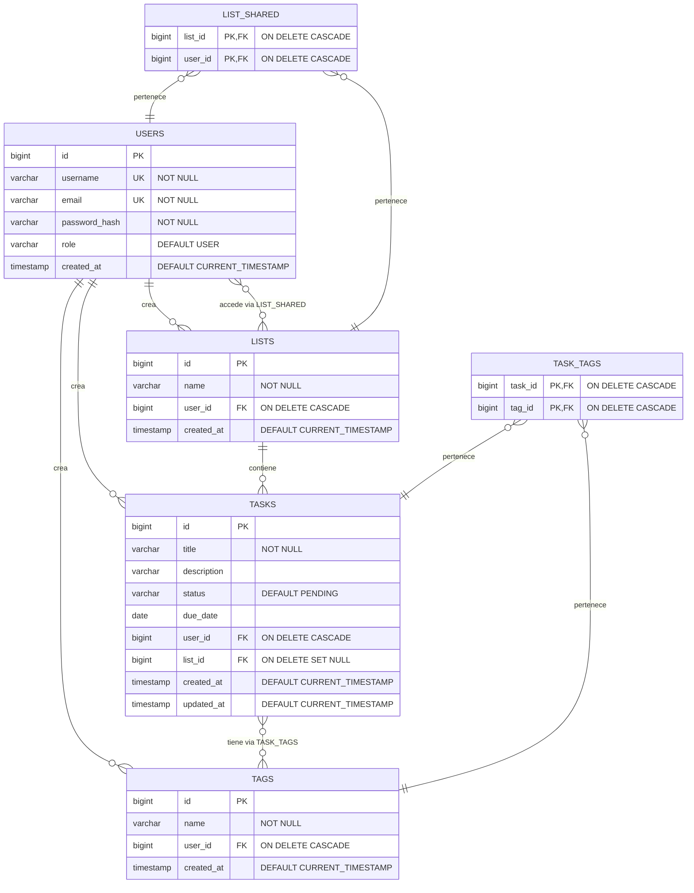

# ✅ To-Do List API

> API REST desarrollada en Spring Boot para gestión colaborativa de tareas con sistema de etiquetas

[](https://openjdk.org/)
[](https://spring.io/projects/spring-boot)
[](https://www.postgresql.org/)
[](LICENSE)

API REST desarrollada con **Spring Boot** y **Java 17** que permite gestionar usuarios, crear listas de tareas con etiquetas y compartirlas de forma colaborativa. Proyecto desarrollado por **Danna Patricia Collaguazo Mera** y **Samuel Moniz Pereira**.

---

## 🚀 Características

- **👥 Gestión de usuarios** - Registro, autenticación con JWT
- **📝 Listas de tareas** - Creación y administración de listas con múltiples tareas
- **🏷️ Sistema de etiquetas** - Organiza tus tareas con tags personalizadas
- **🔗 Colaboración** - Compartir listas entre diferentes usuarios con control de permisos
- **🔒 Seguridad robusta** - Implementación completa con Spring Security
- **🗄️ Base de datos dual** - PostgreSQL para producción, H2 para desarrollo

---

## 🛠️ Stack Tecnológico

| Tecnología | Uso |
|------------|-----|
| **Java 17** | Lenguaje principal |
| **Spring Boot 3.x** | Framework backend |
| **Spring Security** | Autenticación y autorización |
| **Spring Data JPA** | Persistencia de datos |
| **Spring Validation** | Validación de datos |
| **PostgreSQL** | Base de datos principal |
| **H2 Database** | Base de datos para desarrollo |
| **Maven** | Gestión de dependencias |

---

## 🌐 Repositorios

- 🔧 **Backend**: [To-do-list-Backend](https://github.com/DannaPatricia/To-do-list-Backend)
- 🎨 **Frontend**: [To-do-list-Frontend](https://github.com/sam324sam/To-do-list-Frontend)

---

## ⚙️ Instalación y Configuración

### Prerrequisitos

- Java 17 o superior
- Maven 3.8+
- PostgreSQL 15+ (para producción)

### Pasos de instalación

1. **Clonar el repositorio**

```bash
git clone https://github.com/DannaPatricia/To-do-list-Backend.git
cd To-do-list-Backend
```

2. **Configurar la base de datos**

Crear una base de datos PostgreSQL:

```sql
CREATE DATABASE todolist_db;
```

Instalacion de la base de datos
- Importar la base de datos de nuestro **[archivo](./BackupDB/To-Do-List-DB.sql)**. Y luego ejecutar el comando en psql 
```psql
\i "Donder ser descarge el archivo"'
```

Configurar las credenciales en `src/main/resources/application.properties`:

```properties
spring.datasource.url=jdbc:postgresql://localhost:5432/todolist_db
spring.datasource.username=tu_usuario
spring.datasource.password=tu_contraseña
```

3. **Ejecutar la aplicación**

```bash
mvn spring-boot:run
```

4. **Acceder a la aplicación**

La API estará disponible en: `http://localhost:8080`

---

## 📡 Endpoints Principales

### 🔐 Autenticación y Usuarios

| Método | Endpoint | Descripción | Body Example |
|--------|----------|-------------|--------------|
| `POST` | `/api/user/register` | Registro de nuevo usuario | `{"username": "usuario", "password": "1234", "email": "user@mail.com"}` |
| `POST` | `/api/user/login` | Inicio de sesión | `{"username": "usuario", "password": "1234"}` |
| `GET` | `/api/user/searchUser?namePart={name}` | Buscar usuarios por nombre | - |

### 📋 Listas

| Método | Endpoint | Descripción | Body Example |
|--------|----------|-------------|--------------|
| `GET` | `/api/lists/me` | Obtener listas del usuario autenticado | - |
| `POST` | `/api/lists/create` | Crear nueva lista | `{"name": "Mi Lista"}` |
| `PUT` | `/api/lists/update/{id}` | Actualizar nombre de lista | `{"name": "Nuevo Nombre"}` |
| `DELETE` | `/api/lists/delete/{id}` | Eliminar lista | - |

### 🤝 Compartir Listas

| Método | Endpoint | Descripción | Body Example |
|--------|----------|-------------|--------------|
| `POST` | `/api/lists/share` | Compartir lista con usuario | `{"listId": 2, "userId": 5}` |
| `DELETE` | `/api/lists/share` | Revocar acceso a lista compartida | `{"listId": 2, "userId": 5}` |

### ✅ Tareas

| Método | Endpoint | Descripción | Body Example |
|--------|----------|-------------|--------------|
| `GET` | `/api/task/{id}` | Obtener tarea por ID | - |
| `POST` | `/api/task/create/{listId}` | Crear tarea en una lista | `{"title": "Tarea 1", "description": "Descripción", "dueDate": "2025-09-22"}` |
| `PUT` | `/api/task/update/{id}` | Actualizar tarea | `{"title": "Nueva tarea", "description": "Desc", "status": "DONE", "tags": ["tag1"], "dueDate": "2025-09-24"}` |
| `DELETE` | `/api/task/delete/{id}` | Eliminar tarea | - |

### 🏷️ Etiquetas (Tags)

| Método | Endpoint | Descripción | Body Example |
|--------|----------|-------------|--------------|
| `GET` | `/api/tag/me` | Obtener etiquetas del usuario | - |
| `POST` | `/api/tag/create` | Crear nueva etiqueta | `{"name": "Urgente", "taskId": "1"}` |
| `PUT` | `/api/tag/update` | Actualizar etiqueta | `{"name": "Nuevo nombre", "id": "7"}` |
| `DELETE` | `/api/tag/delete/{id}` | Eliminar etiqueta | - |

### 📥 Colección de Postman

Importa la colección completa de endpoints: **[ToDoList.postman_collection.json](./ToDoList.postman_collection.json)**

> 💡 **Tip**: La colección de Postman incluye todos los ejemplos de peticiones necesarios para probar la API.

---

## 📂 Estructura del Proyecto

```
src/
├── main/
   ├── java/com/todolist/api/
   │   ├── config/           # Configuraciones de Spring
   │   ├── controller/       # Controladores REST
   │   ├── dto/              # Data Transfer Objects
   │   ├── model/            # Entidades JPA
   │   ├── repository/       # Repositorios de datos
   │   ├── security/         # Configuración de seguridad
   │   └── service/          # Lógica de negocio
   └── resources/
       ├── application.properties        # Configuración principal
       └── application-dev.properties    # Configuración desarrollo

```

---

## 🗄️ Modelo de Base de Datos



### 📊 Características de la Base de Datos

**🔑 Claves y Constraints:**
- `USERS`: Username y email únicos
- `TAGS`: Nombre único por usuario (combinación name + user_id)
- `LIST_SHARED`: Clave primaria compuesta (list_id + user_id)
- `TASK_TAGS`: Clave primaria compuesta (task_id + tag_id)

**🗑️ Políticas de Eliminación:**
- Si se elimina un **usuario**: Se eliminan todas sus listas, tareas, tags y compartidos
- Si se elimina una **lista**: Se eliminan todos los compartidos de esa lista
- Si se elimina una **lista con tareas**: Las tareas quedan huérfanas (list_id = NULL)
- Si se elimina una **tarea**: Se eliminan todas sus asociaciones con tags
- Si se elimina un **tag**: Se eliminan todas sus asociaciones con tareas

---

## 💡 Notas Técnicas

### Características de la Implementación

- **Soft Delete en Listas**: Las tareas no se eliminan cuando se borra una lista, se mantienen con `list_id = NULL`
- **Tags Únicos por Usuario**: Un mismo tag puede existir para diferentes usuarios sin conflicto
- **Cascada Completa**: La eliminación de usuarios limpia automáticamente todos sus datos relacionados
- **Timestamps Automáticos**: Las tablas principales tienen `created_at` y `updated_at` automáticos

### Índices y Optimizaciones

La base de datos cuenta con:
- Índices únicos en `users.username` y `users.email`
- Índice compuesto único en `tags(name, user_id)`
- Claves foráneas con índices implícitos para mejores JOINs

---

## 🔐 Autenticación

La API utiliza **JWT (JSON Web Tokens)** para la autenticación:

1. **Registro**: Crea una cuenta en `/api/user/register`
2. **Login**: Obtén tu token en `/api/user/login`

---

## 🔐 Seguridad

La API implementa:

- **JWT** para autenticación stateless
- **BCrypt** para hash de contraseñas
- **CORS** configurado para permitir orígenes específicos
- **Validación** de datos en todos los endpoints
- **Control de permisos** en listas compartidas

---

## 👥 Autores

<table>
  <tr>
    <td align="center">
      <a href="https://github.com/DannaPatricia">
        <br />
        <sub><b>Danna Patricia Collaguazo Mera</b></sub>
      </a><br />
    </td>
      <td align="center">
      <a href="https://github.com/sam324sam">
        <br />
        <sub><b>Samuel Moniz Pereira</b></sub>
      </a><br />
    </td>
  </tr>
</table>

---

<div align="center">
  <p>Hecho con ❤️ por Danna Patricia Mera y  Samuel Moniz Pereira</p>
  <p>⭐ Si te gusta este proyecto, dale una estrella en GitHub ⭐</p>
</div>
